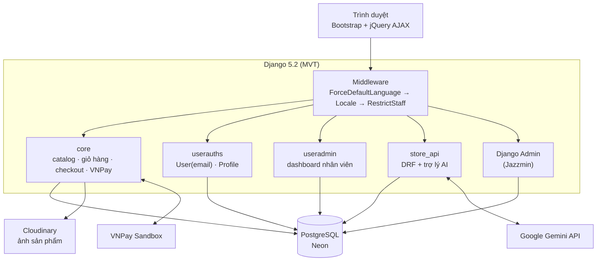
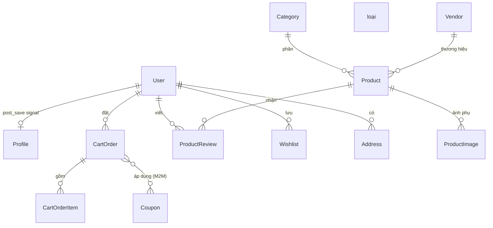
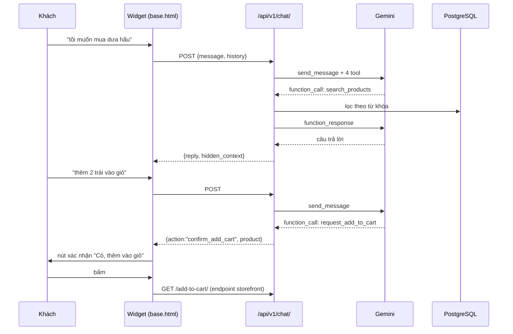

# Kiến trúc hệ thống Grocerly

> Cập nhật: 2026-08-26 · Đối chiếu với commit `a5682a7`

## 1. Bối cảnh nghiệp vụ

Grocerly là website bán thực phẩm/tạp hóa trực tuyến của **một siêu thị duy nhất**,
có nhân viên vận hành và trợ lý AI hỗ trợ khách hàng.

Điểm dễ hiểu nhầm: model `Vendor` **không phải** người bán có tài khoản đăng nhập.
Dữ liệu thực tế trong bảng này là *Vinamilk, Coca-Cola, Masan, Acecook, CP, TH True
Milk…* — tức **thương hiệu / nhà cung cấp**, đóng vai trò thuộc tính của sản phẩm.
Nhân viên chọn Vendor từ dropdown khi đăng sản phẩm. Xem ADR-0003 trong
[DECISIONS.md](DECISIONS.md).

### Tác nhân

| Tác nhân | Cờ trong DB | Giao diện | Phạm vi |
|---|---|---|---|
| Khách vãng lai | — | Storefront | Xem sản phẩm, tìm kiếm, chat AI, giỏ hàng (session) |
| Khách hàng | user thường | Storefront + `/dashboard/` | Đặt hàng, wishlist, đánh giá, lịch sử đơn |
| Nhân viên (Staff) | `is_staff` | `/useradmin/` | Sản phẩm, tồn kho, đơn hàng, doanh thu |
| Quản trị viên (Admin) | `is_superuser` | `/admin/` (Jazzmin) + `/useradmin/` | Toàn quyền: user, danh mục, coupon, kiểm duyệt |

Admin kế thừa toàn bộ quyền của Staff (`admin_required` chấp nhận cả hai cờ).
Lý do giữ hai vai trò: ADR-0001.

## 2. Tổng quan thành phần



**Định tuyến** ([grocerly/urls.py](../grocerly/grocerly/urls.py)):
`/api/v1/` đặt **ngoài** `i18n_patterns` (API không cần tiền tố ngôn ngữ);
`/admin/`, `/`, `/user/`, `/useradmin/` nằm **trong** `i18n_patterns` → có tiền tố
`/vi/` hoặc `/en/`.

## 3. Mô hình dữ liệu

### Hạ tầng xóa mềm

`SoftDeleteModel` (abstract) cấp cho `Category`, `Vendor`, `Product`, `Coupon`:

- `objects` → chỉ bản ghi còn sống · `all_objects` → tất cả
- `instance.soft_delete()` / `.restore()` / `.hard_delete()`
- `Vendor.soft_delete()` **lan truyền** xuống toàn bộ sản phẩm của vendor đó;
  `restore()` khôi phục đúng nhóm sản phẩm bị xóa cùng thời điểm (khớp `deleted_at`)

⚠️ `instance.delete()` **vẫn xóa cứng** — chỉ `QuerySet.delete()` mới xóa mềm.
Đây là **Bẫy #3** trong AGENTS.md, nay đã có test chốt lại ở
[core/test_softdelete.py](../grocerly/core/test_softdelete.py).

⚠️ `dead()` / `alive()` là phương thức của **QuerySet**, không được proxy lên manager.
Phải viết `Model.all_objects.all().dead()`; gọi tắt `all_objects.dead()` ném
`AttributeError`.

> **Ghi chú 2026-08-26:** vế `restore()` ở trên **mô tả đúng ý định nhưng sai thực tế**
> cho tới ngày này. `soft_delete()` gọi `timezone.now()` **hai lần** — một cho vendor,
> một cho nhóm sản phẩm — nên hai dấu thời gian lệch nhau vài trăm micro giây (đo được
> 563µs) và bộ lọc `deleted_at` của `restore()` không khớp dòng nào. Kết quả: khôi phục
> vendor thì vendor sống lại **một mình với gian hàng trống**, sản phẩm kẹt vĩnh viễn ở
> trạng thái xóa mềm. Đã vá — sản phẩm nay dùng chính `self.deleted_at` của vendor.

### Các thực thể chính



Ghi chú quan trọng:

- **Định danh công khai** dùng ShortUUID: `Category.c_id`, `Vendor.v_id`,
  `Product.p_id`/`sku`, `CartOrder.oid`. URL không lộ khóa chính số.
- **`CartOrderItem` lưu snapshot** (`item`, `image`, `price` dạng chuỗi/số), **không**
  FK tới `Product`. Ưu điểm: hóa đơn không đổi khi sản phẩm bị sửa/xóa. Nhược điểm:
  không truy vết được sản phẩm gốc — `change_order_status` phải khớp lại bằng
  `Product.objects.filter(title=item.item)`, rất dễ sai khi trùng tên.
- **Tag** do `django-taggit` quản lý ở bảng riêng; `core.models.Tag` là stub rỗng không dùng.

### Ba cờ trạng thái của Product

| Trường | Kiểu | Ý nghĩa | Ai đọc |
|---|---|---|---|
| `product_status` | `draft` / `published` / `disabled` | Trạng thái đăng bán, nhân viên tự đặt | storefront **và** `store_api` |
| `status` | bool | Cờ bật/tắt kế thừa từ template gốc | `store_api` |
| `in_stock` | bool | Còn hàng (tách rời `stock_count`) | `store_api` |

`product_status` **không còn** `in_review`/`rejected` — không có bước duyệt, xem
[ADR-0002](DECISIONS.md).

Điều kiện hiển thị nay nằm ở **một chỗ duy nhất**:

```python
Product.objects.published()   # ProductQuerySet.published() trong core/models.py
```

Trước 2026-08-24, điều kiện này bị chép tay 12 lần trong `core/views.py` còn `store_api`
lại lọc theo `status`/`in_stock` — chính sự lệch đó là lỗ hổng S-04. Ba cờ vẫn chồng lấn
nhau (nợ kỹ thuật còn lại), nhưng `published()` giờ là điều kiện bắt buộc ở mọi nơi.

## 4. Các luồng chính

### 4.1 Giỏ hàng (session-based)

Không có model Cart. Giỏ nằm ở `request.session['cart_data_obj']`, dạng
`{ product_id: {title, qty, price, image, pid} }`. Nhờ vậy khách vãng lai cũng thêm được
vào giỏ mà không cần đăng nhập.

Helper `safe_float()` / `safe_int()` trong [core/views.py](../grocerly/core/views.py)
xử lý định dạng số kiểu Việt Nam (dấu chấm ngăn nghìn) đến từ template.

`add_to_cart` chỉ nhận `id` + `qty` từ client; `title`, `price`, `image` đọc lại từ
`Product`, kèm kiểm `product_status='published'` và `stock_count`. Trước 2026-08-24 giá
lấy thẳng từ query string — xem [SECURITY.md](SECURITY.md) mục S-02.

Hai JS gọi endpoint này vẫn gửi dư `title`/`price`/`image`; server bỏ qua.

Bốn thao tác trên giỏ: `add_to_cart`, `update_cart`, `delete_item_from_cart` (xóa **một**
sản phẩm) đều là GET — xem [SECURITY.md](SECURITY.md) mục S-10 — còn `clear_cart` (xóa
**sạch**, thêm 2026-08-26) là **POST + CSRF**. Chênh lệch này có chủ ý: endpoint mới
không nên nối dài danh sách ghi dữ liệu bằng GET; bốn cái cũ dọn ở bước 2.14.

`clear_cart` bỏ luôn `session['pending_order_oid']` — không thì khách xóa sạch giỏ rồi
bấm Thanh toán sẽ bị đá vào đúng cái đơn chứa những món vừa xóa. Bản ghi `CartOrder` chưa
thanh toán vẫn nằm nguyên: xóa giỏ **không phải** hủy đơn (A7, bước 2.10).

⚠️ Bản async của giỏ (`core/async/cart-list.html`) render qua `render_to_string` **không
truyền `request=`**, khác hai lời gọi tương tự cho product-list và wishlist trong cùng
file. Nghĩa là context **không phải** `RequestContext`: `` render ra rỗng
và không có context processor nào chạy. Token nay được truyền thẳng vào context; giữ vậy
có chủ ý để không kéo theo truy vấn Address/Wishlist mỗi lần đổi số lượng (nợ kỹ thuật #2).

### 4.2 Đặt hàng & thanh toán

```
/cart/ → /checkout-info/ → save_checkout_info  (tạo CartOrder + CartOrderItem,
                                                lưu oid vào session)
                                ↓
                          /checkout/<oid>/     (áp coupon, chọn hình thức trả tiền)
                          ↙            ↘
              VNPay (online)          COD
                    ↓                   ↓
        vnpay_return + vnpay_ipn    place_cod_order
                    ↘              ↙
                /payment-completed/<oid>/
```

- **VNPay** tự implement trong [core/vnpay.py](../grocerly/core/vnpay.py): ký
  HMAC-SHA512 trên chuỗi tham số đã sort, `vnp_TxnRef = "{oid}-{timestamp}"` để mỗi lần
  thanh toán lại có mã giao dịch mới nhưng vẫn tra ngược được đơn.
- `vnpay_return` phục vụ trình duyệt; `vnpay_ipn` là webhook server-to-server, có kiểm
  tra số tiền và chống xác nhận trùng.
- **COD**: `place_cod_order` chỉ đánh dấu phương thức; `paid_status` được bật khi nhân
  viên chuyển đơn sang `delivered`.
- Cơ chế **đơn treo**: `session['pending_order_oid']` cho phép khách quay lại hoàn tất
  đơn chưa thanh toán thay vì tạo đơn trùng.

### 4.3 Trợ lý AI



Bốn tool khai báo với Gemini: `search_products`, `get_bestsellers` (thực thi ở server) và
`request_add_to_cart`, `request_checkout` (**stub cố ý** — thân hàm là `pass`).

Lý do hai tool sau là stub: giỏ hàng nằm trong **session của trình duyệt**, mà request
tới `/api/v1/chat/` không nên tự ý ghi giỏ hàng. Thay vào đó server trả cờ `action`,
widget hiện nút xác nhận, rồi **client** mới gọi endpoint storefront. Vừa giữ được vòng
xác nhận của người dùng, vừa tránh AI tự ý thêm hàng.

Vòng lặp function calling được viết **thủ công**, giới hạn 3 bước để chống đệ quy vô hạn.
Có xử lý riêng lỗi quota 429 (phân biệt hết hạn ngạch ngày với chờ retry theo giây).

⚠️ Sơ đồ tuần tự Hình 26 trong báo cáo mô tả server tự ghi session — **khác thực tế**.
Xem [SPEC-GAPS.md](SPEC-GAPS.md).

### 4.4 Đa ngôn ngữ

`ForceDefaultLanguageMiddleware` **xóa header `Accept-Language`** trước khi
`LocaleMiddleware` chạy. Mục đích: người dùng Việt Nam dùng trình duyệt cài tiếng Anh
vẫn thấy giao diện tiếng Việt, trừ khi tự đổi ngôn ngữ (lưu vào session/cookie).

Thứ tự middleware là **bắt buộc**: `ForceDefaultLanguage` phải đứng **trước** `Locale`.

## 5. Cấu hình môi trường

`settings.py` chọn database theo thứ tự ưu tiên:

1. `POSTGRES_DB` (+ USER/PASSWORD/HOST/PORT) → PostgreSQL
2. `DATABASE_URL` (dạng `postgres://…`) → PostgreSQL
3. Không có gì → SQLite `db.sqlite3`

Biến môi trường khác: `DJANGO_SECRET_KEY`, `DJANGO_DEBUG`, `DJANGO_ALLOWED_HOSTS`,
`USE_CLOUDINARY`, `CLOUDINARY_URL`, `GEMINI_API_KEY`, `VNPAY_TMN_CODE`,
`VNPAY_HASH_SECRET`, `VNPAY_PAYMENT_URL`. Mẫu ở `grocerly/.env.example`.

`SECRET_KEY` có giá trị mặc định `django-insecure-…` khi thiếu biến môi trường — tiện cho
dev nhưng nguy hiểm nếu production quên set. Xem [SECURITY.md](SECURITY.md) mục S-05.

## 6. Triển khai

**Đang dùng — Render**: `build.sh` cài dependency → `collectstatic` → cài `gettext` →
`compilemessages` → `migrate`. Gunicorn phục vụ WSGI, WhiteNoise phục vụ static,
Cloudinary phục vụ media, Neon làm database.

**Có sẵn nhưng không dùng chính**: `Dockerfile` (multi-stage, Python 3.12-slim),
`docker-compose.yml` (web + nginx), `ec2-setup.sh`, `ecr-lifecycle-policy.json`.
Lưu ý `docker-compose.yml` còn tham chiếu biến `USE_S3`/`AWS_*` từ thời dùng S3, trong
khi `settings.py` hiện chỉ hiểu `USE_CLOUDINARY` — cấu hình này đã lỗi thời.

## 7. Nợ kỹ thuật đã biết

| # | Vấn đề | Ảnh hưởng |
|---|---|---|
| 1 | **140 test** tính đến 2026-08-26, nhưng **checkout vẫn trống**: không test nào chạm `save_checkout_info`; `userauths/tests.py` còn là stub rỗng | Luồng tạo đơn — chỗ rủi ro nhất — chưa có lưới an toàn, mà bước 2.11 sẽ viết lại đúng hàm đó. Xem [PLAN](PLAN.md) bước 2.6f |
| 2 | Truy vấn không `select_related` → N+1 | Chậm khi dữ liệu lớn |
| 3 | Không phân trang ở mọi trang danh sách | Tải toàn bộ sản phẩm mỗi request |
| 4 | `useradmin` không giới hạn phạm vi theo nhân viên | Mọi staff thấy toàn bộ dữ liệu |
| 5 | Ba cờ trạng thái Product chồng chéo (`product_status` / `status` / `in_stock`) | S-04 đã vá, nhưng `status` và `in_stock` vẫn là cờ thừa chưa ai dọn |
| 6 | `CartOrderItem` khớp sản phẩm bằng `title` | Nay có **hai** chỗ phụ thuộc: `change_order_status` trừ kho sai khi trùng tên, và `delete_product` dò "đã có đơn chưa" cũng theo tên (nhầm về phía an toàn — xóa mềm thay vì xóa cứng). [ADR-0006](DECISIONS.md) / [PLAN](PLAN.md) bước 2.11 dọn cả hai |
| 7 | ~20 template mồ côi (`index2`, `product-lists`, `login`…) | Gây nhiễu khi tìm file |
| 8 | `login_view` dùng `except:` trần | Nuốt lỗi thật, khó debug |
